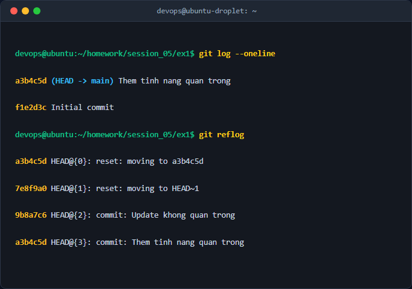

# Báo cáo kỹ thuật: Khôi phục Commit đã mất bằng Git Reflog

## 1. Mục tiêu & Bối cảnh kỹ thuật
- **Mục tiêu:** Hiểu và thành thạo cơ chế lưu trữ lịch sử cục bộ của Git Reflog, biết cách truy vết các tham chiếu commit cũ và khôi phục thành công các commit bị mất sau khi thực hiện lệnh nguy hiểm như `git reset --hard`.
- **Bối cảnh:** Trong quá trình phát triển phần mềm với Java/Spring Boot, lập trình viên vô tình thực thi lệnh `git reset --hard HEAD~1`, làm mất đi commit quan trọng chứa mã nguồn tính năng mới mà chưa được đẩy lên Remote Repository. Bài báo cáo này trình bày quy trình khôi phục an toàn sử dụng Git Reflog.

## 2. Các bước thực hiện chi tiết
### Bước 1: Khởi tạo dự án Java mẫu và tạo commit ban đầu
Tạo thư mục làm việc, khởi tạo Git repository và tạo tệp mã nguồn Java `Main.java` để giả lập mã nguồn thực tế.
```bash
git init
echo 'public class Main { public static void main(String[] args) { System.out.println("Day la tinh nang quan trong"); } }' > Main.java
git add Main.java
git commit -m "Them tinh nang quan trong"
```
- *Giải thích cờ tham số:* `git init` khởi tạo kho chứa Git cục bộ; `git add` đưa file vào Staging Area; `git commit -m` lưu trữ các thay đổi kèm theo thông điệp mô tả.

### Bước 2: Giả lập sự cố mất commit
Thực hiện một commit phụ tiếp theo và tiến hành reset cứng lùi về trước để giả lập sự cố mất mát dữ liệu.
```bash
echo '// update' >> Main.java
git commit -am "Update khong quan trong"
git reset --hard HEAD~1
```
- *Giải thích cờ tham số:* `--hard` là cờ cực kỳ nguy hiểm, bắt buộc Git phải xóa sạch các thay đổi trong Staging Area và Working Directory, đồng thời ép con trỏ `HEAD` quay về commit chỉ định.

### Bước 3: Tra cứu lịch sử Reflog để tìm commit đã mất
Kiểm tra lại lịch sử thay đổi tham chiếu của `HEAD` bằng lệnh `git reflog`.
```bash
git reflog
```
- *Giải thích cờ tham số:* `git reflog` liệt kê mọi dịch chuyển của con trỏ `HEAD` (bao gồm các commit bị reset, checkout, rebase), giúp truy vết lại mã hash (`SHA-1`) của commit cũ trước khi bị xóa.

### Bước 4: Khôi phục lại trạng thái commit ban đầu
Sử dụng mã hash tìm được trong nhật ký reflog để khôi phục lại trạng thái cũ.
```bash
git reset --hard <commit_hash>
```
- *Giải thích cờ tham số:* Thay `<commit_hash>` bằng giá trị thực tế lấy từ nhật ký `git reflog` để ép nhánh hiện tại trỏ lại đúng commit chứa tính năng quan trọng.

## 3. Kiểm tra & Xác thực kết quả
Thực thi lệnh kiểm tra lịch sử commit để xác nhận tính năng đã được phục hồi hoàn toàn.
```bash
git log --oneline
```



## 4. Kết luận & Best Practices bảo mật vận hành
- **Best Practices:** 
  - Luôn cẩn trọng khi sử dụng cờ `--hard` trong `git reset` hoặc `git clean -fd`. Sử dụng `git stash` hoặc `git branch` tạm thời trước khi thử nghiệm các thay đổi lớn.
  - Git Reflog là "cứu cánh" quan trọng cho các thao tác cục bộ, tuy nhiên nó chỉ lưu trữ trên máy cá nhân trong một khoảng thời gian giới hạn (mặc định 30 ngày).
  - Thường xuyên đẩy mã nguồn (`git push`) lên remote repository để đảm bảo an toàn dữ liệu trên môi trường cloud.